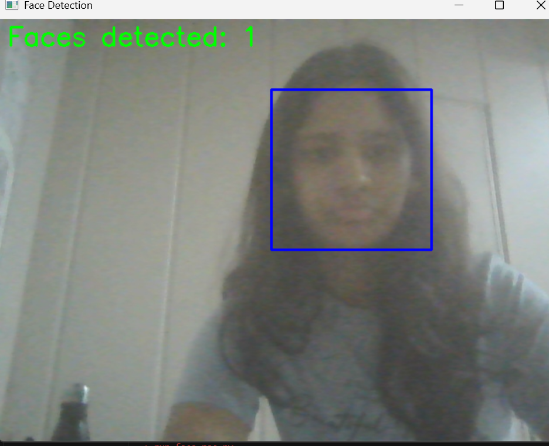

Great! Here's the updated `README.md` with `results.png` included as a sample output:

---

# 👁️ Real-Time Face Detection with OpenCV

This project detects human faces in real-time from a webcam feed using **OpenCV** and a **Haar Cascade Classifier**. It also displays the number of faces detected in each frame.

## 📌 Features

* Real-time face detection using your system's webcam
* Uses OpenCV’s Haar cascade classifier (`haarcascade_frontalface_default.xml`)
* Displays bounding boxes around faces
* Shows live face count overlay on video
* Press `Esc` to exit and print the last detected face count

## 🧰 Tech Stack

* Python 3.x
* OpenCV (`cv2`)

## 🚀 Getting Started

### 1. Clone the Repository

```bash
git clone https://github.com/yourusername/face-detection-opencv.git
cd face-detection-opencv
```

### 2. Install Dependencies

```bash
pip install opencv-python
```

### 3. Add Haar Cascade File

Download [`haarcascade_frontalface_default.xml`](https://github.com/opencv/opencv/blob/master/data/haarcascades/haarcascade_frontalface_default.xml) and place it in the same directory as your script.

### 4. Run the Script

```bash
python face_detect.py
```

## 📂 File Structure

```
.
├── face_detect.py
├── haarcascade_frontalface_default.xml
├── results.png
└── README.md
```

## 🧠 How It Works

* Captures webcam feed using OpenCV
* Converts each frame to grayscale for better detection performance
* Uses Haar Cascade Classifier to detect faces
* Draws rectangles around detected faces and shows a count
* Exits when the `Esc` key is pressed and prints the count in the terminal

## 📸 Sample Output

Here’s a sample detection result:



## 📄 License

This project is open-source and available under the MIT License.

---

Let me know if you want help generating `results.png` from your code output or converting it to a GIF!
